---
CyberPreacher Lab:
    title: '08 - Organization Case Study 1'
    difficulty: 'Hard'
---

# Project 08: Organization Case Study 1
## CyberPreacher Edition  

## Summary
This project provides a comprehensive case study for deploying and securing an Azure environment for CyberPreacher LTD, a digital media company with distributed teams in Chicago and San Francisco. The lab guides you through reconstructing the company's Azure infrastructure using ARM templates, configuring networking and security (including Azure Firewall, route tables, and AKS), and implementing identity and access controls with Entra ID. It also covers platform protection requirements such as antimalware deployment, JIT VM access, custom RBAC roles, and enforcing application registration and consent policies. The solution emphasizes best practices for resource management, secure access, and compliance with organizational security standards.

## Compamy Overview  

CyberPreacher LTD is a digital media company that has 5 employees in the Chicago area and 10 employees in the San Francisco area.

Existing Environment

CyberPreeacher LTD has an Azure subscription named Sub1 that has a Subscription ID of XXXXXXXX-XXXX-XXXXXXXX-XXXXXXXXXXXX

Sub1 is associated to an Azure Entra ID tenant named example.com. The tenant contains the user objects and the device objects of all the CyberPreacher employees and their devices. Each user is assigned an Azure entra ID Premium P2 License. Entra ID Privileged Identity Management (PIM) is activated.

The Tenant contains the groups shown in the following table.

|Name|Type|Description|
|---|---|---|
|Group1|Security group|A group that has the Dynamic user membership type, contains all the San Francisco users, and provides access to many Entra ID applications and Azure resources.|
|Group2|Security group|A group that has the Dynamic user membership type and contains the Chicago It team.|

The Azure Subscription contains the following Resource Groups. **AZ500RG1** and **AZ500RG2**

**AZ500RG1** has the following resources:
|Name|Type|Description|
|---|---|---|
|VNet1|Virtual network|VNet1 is a virtual network that contains security-sensitive IT resources. VNet1 contains three subnets named Subnet0, Subnet1, and AzureFirewallSubnet.|
|VM0|Virtual machine|VM0 is an Azure virtual machine that runs windows server 2016 and connects to Subnet0.|
|VM1|Virtual machine|VM1 is an Azure virtual machine that runs Windows Server 2016 and connects to Subnet0.|
|SQLDB1|Azure SQL Database|Sqldb1 is an Azure SQL database on a SQL Database server named LitwareSQLServer1.|
|WebApp1|Web app|WebApp1 is an azure web app that is accessible by using https://example.com|
|AZ500RG1|Resource group|AZ500RG1 is a resource group that contains VNet1, VM0, and VM1.|
|AZ500RG2|Resource group|AZ500RG2 is a resource group that contains shared IT resources.|

Azure Security Center is set to Free Tier. 
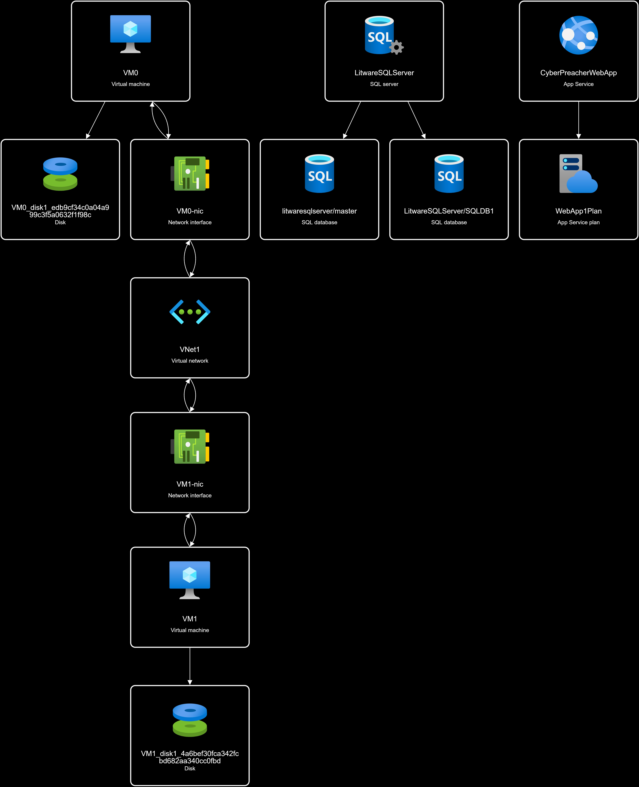

To reconstruct the environment, use the prebuilt ARM Deployment Template that I created for this Lab.

1. **Resource Group 1**: [AZ500RG1](../Lab_Files/AZ500RG1.zip.zip) 
2. **SQL Server**: [SQL-DB](../Lab_Files/SQL_AZ500.zip.zip)
3. Manually create an empty Resource Group 2 named AZ500RG2.
4. Bulk import Users: [Users](../Lab_Files/bulkusertemplate.csv)
4. Create **Group1** Security group in Entra ID, ensuring that it uses **Dynamic User Membership** based users in San Francisco.
5. Create **Group2** Security group in Entra ID, ensuring that it uses **Dynamic User Membership** based on users in Chicago.

AZ500RG2 is a resource group that contains shared IT resources.

> All resources will be created in a East US 2.

#### Planned Changes  

|Name|Type|Description|
|---|---|---|
|Firewall|Azure Firewall|An Azure Fierwall on VNET1|
|RT1|Route Table|A route table that will contain a route pointing to Firewall1 as the default gateway and will be assigned to Subnet0|
|AKS1|Azure Kubernetes Services(AKS)|A managed AKS cluster|

#### Identity and Access Requirement

- All San Francisco users and their devices must be members of Group1

- The members of Group2 must be assigned the **contributor role** to **AZ500RG2** by using permanent eligible assignment.

- Users must be prevented from registering applications in Entra ID and from consenting to applications that access company information on the users' behalf.

#### Platform Protection Requirements

CyberPreacher LTD identifies the following platform protection requirements:

- Microsoft Antimalware must be installed on the Virtual machines in **AZ500RG1**.

- Members of Group2 must be assigned the Azure Kubernetes Service Cluster Admin Role.

- Entra ID users must be able to authenticate to AKS1 by using their Entra ID credentials.

- Following the implementation of the planned changes, the IT team must be able to connect to VM0 by using JIT VM access.

- A new custom RBAC role name Role1 must be used to delegate the administration of the managed disks in **AZ500RG1**. Role1 must be available only for RG1

## Solution  

To meet planned changes, I would have to create a firewall, route table and kubernetes service

### Meeting the Planned Changes requirements
### Exercise 1: Deploy an Azure Firewall on VNET1  
#### Estimated timing: 10 minutes  

#### Step-by-Step: Deploy Azure Firewall on VNET1

1. **Navigate to the Azure Portal**
    - Go to [https://portal.azure.com](https://portal.azure.com) and sign in with your credentials.

2. **Open the Resource Group**
    - In the left menu, select **Resource groups**.
    - Click on **AZ500RG1**.

3. **Create Azure Firewall**
    - Click **Create** > **Resource**.
    - Search for **Firewall** and select **Azure Firewall**.
    - Click **Create**.

4. **Configure Firewall Basics**
    - **Subscription**: Select *your subscription*.
    - **Resource Group**: Choose *AZ500RG1*.
    - **Name**: Enter a name (e.g., `Firewall1`).
    - **Region**: Select *East US 2*.

5. **Configure Firewall Settings**
    - **Firewall management**: Choose *Use Firewall Policy* (Create New Basic Policy).
    - **Virtual network**: Select *VNET1*.
    - **Public IP address**: Click *Create new*, provide a name (e.g., `Firewall1-pip`), and click *OK*.

6. **Review and Create**
    - Click **Review + create**.
    - After validation, click **Create**.

7. **Verify Deployment**
    - Once deployment completes, go to **AZ500RG1** and confirm that **Firewall1** and its public IP are present.
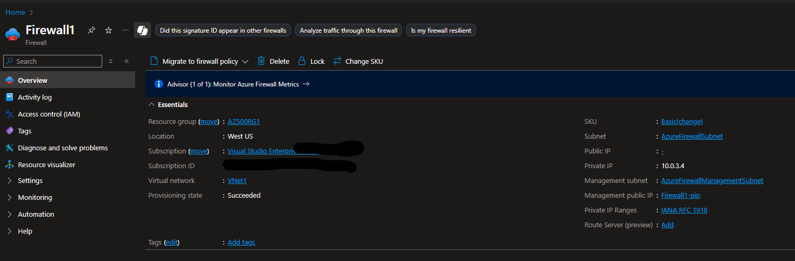

8. **(Optional) Configure Firewall Rules**
    - Open **Firewall1**.
    - Add network or application rules as needed for your environment.


### Exercise 2: Create Route Table
#### Description: A route table that will contain a route pointing to Firewall1 as the default gateway and will be assigned to Subnet0

1. **Navigate to the Azure Portal**
    - Go to [https://portal.azure.com](https://portal.azure.com) and sign in.

2. **Open the Resource Group**
    - In the left menu, select **Resource groups**.
    - Click on **AZ500RG1**.

3. **Create a Route Table**
    - Click **Create** > **Resource**.
    - Search for **Route Table** and select it.
    - Click **Create**.

4. **Configure Route Table Basics**
    - **Subscription**: Select your subscription.
    - **Resource Group**: Choose *AZ500RG1*.
    - **Region**: Select *East US 2*.
    - **Name**: Enter a name (e.g., `RT1`).
    - Click **Review + create**, then **Create**.

5. **Add a Route to the Route Table**
    - After deployment, open the new route table (**RT1**).
    - In the left menu, select **Routes** > **Add**.
    - **Route name**: Enter a name (e.g., `DefaultToFirewall`).
    - **Address prefix destination**: Enter `0.0.0.0/0`.
    - **Next hop type**: Select **Virtual appliance**.
    - **Next hop address**: Enter the private IP address of **Firewall1**.
    - Click **Add**.

6. **Associate Route Table with Subnet0**
    - In the route table (**RT1**), select **Subnets** > **Associate**.
    - Select **VNET1** and then choose **Subnet0**.
    - Click **OK** to associate.

7. **Verify Configuration**
    - Confirm that **RT1** is associated with **Subnet0** and the route points to **Firewall1** as the default gateway.
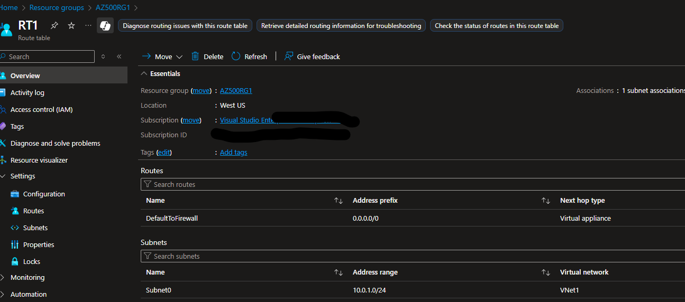

### Exercise 3: Deploying Azure Kubernetes Service (AKS)
#### Description: A managed AKS cluster

1. **Navigate to the Azure Portal**
    - Go to [https://portal.azure.com](https://portal.azure.com) and sign in.

2. **Open the Resource Group**
    - In the left menu, select **Resource groups**.
    - Click on **AZ500RG1**.

3. **Create AKS Cluster**
    - Click **Create** > **Resource**.
    - Search for **Kubernetes Service** and select it.
    - Click **Create**.

4. **Configure Basics**
    - **Subscription**: Select your subscription.
    - **Resource Group**: Choose *AZ500RG1*.
    - **Cluster name**: Enter a name (e.g., `AKS1`).
    - **Region**: Select *East US 2*.
    - **Kubernetes version**: Select the default or latest available.

5. **Configure Authentication**
    - Under **Authentication**, select **Entra ID with Azure RBAC** integration.
    - Choose your Entra ID tenant and configure admin and user groups as required.

    Select **Next**.

6. **Configure Node Pools**
    - Set the **Node size** and **Node count** as needed (default values are fine for lab purposes).

7. **Networking**
    - Select **Virtual network**: Choose *VNET1*.
    - Select the appropriate subnet (e.g., *Subnet0*).

8. **Review and Create**
    - Click **Review + create**.
    - After validation, click **Create**.

9. **Verify Deployment**
    - Once deployment completes, go to **AKS1** in **AZ500RG1**.
    - Confirm the cluster is running and accessible.

10. **(Optional) Configure RBAC and Access**
    - Assign the **Azure Kubernetes Service Cluster Admin Role** to Group2.
    - Ensure Entra ID users can authenticate to the cluster.
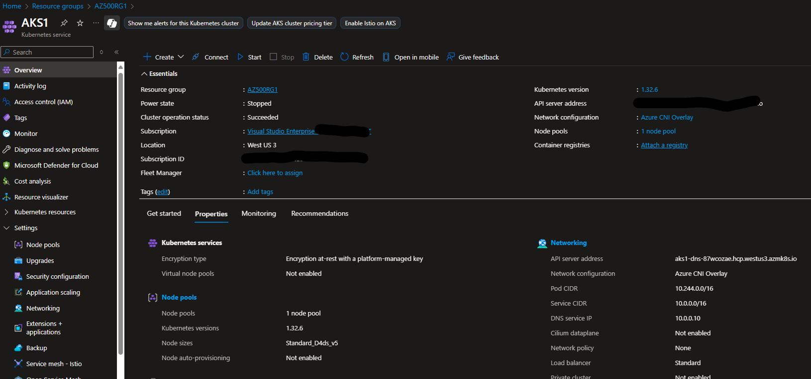

### Meeting Identity and Access Requirement

To meet up with Identity and access requirements:

**Group 1**: Group type has to be changed to **Assigned**, then 2 new groups have to be created for dynamic users and dynamic device for group 1 members, then assign those group into Group 1.

**Group 2**: Assign a contributor role to **AZ500RG2** on Entra ID **Group2**.

**App Registration**: Prevent users from registering application and block user consent to applications.

#### Exercise 1: Group 1

1. **Open Azure Portal**
    - Go to [https://portal.azure.com](https://portal.azure.com) and sign in.

2. **Navigate to Entra ID**
    - In the left menu, select **Entra ID**.

3. **Create a Dynamic User Group for San Francisco Users**
    - Select **Groups** > **New group**.
    - **Group type**: Security.
    - **Group name**: e.g., `SF-Users`.
    - **Membership type**: Dynamic User.
    - Click **Add dynamic query**.
    - Set rule to include users with `physicalDeliveryOfficeName` or `city` attribute set to "San Francisco".
    - Example rule syntax:
      ```
      (user.city -eq "San Francisco")
      ```
    - Click **Save** > **Create**.

4. **Create a Dynamic Device Group for San Francisco Devices**
    - Select **Groups** > **New group**.
    - **Group type**: Security.
    - **Group name**: e.g., `SF-Devices`.
    - **Membership type**: Dynamic Device.
    - Click **Add dynamic query**.
    - Set rule to include devices assigned to San Francisco users (if device attributes allow).
    - Example rule syntax (if using device extension attributes):
      ```
      (device.extensionAttribute1 -eq "San Francisco")
      ```
    - Click **Save** > **Create**.

5. **Change Group1 from Dynamic to Assigned Type**
   - Select **Manage** > **Properties**
   - Change **Group Type** from Dynamic to **Assigned**.
   - Save changes.

6. **Add Dynamic Groups to Group1**
    - Open **Group1**.
    - Select **Members** > **Add members**.
    - Search for and add `SF-Users` and `SF-Devices` groups.
    - Click **Select**.

7. **Verify Membership**
    - In **Group1**, check **Members** to confirm both dynamic groups are listed.
    - Confirm that all San Francisco users and their devices are included via group nesting.

#### Exercise 2: Group 2

1. **Open Azure Portal**
    - Go to [https://portal.azure.com](https://portal.azure.com) and sign in.

2. **Navigate to Resource Groups**
    - In the left menu, select **Resource groups**.
    - Click on **AZ500RG2**.

3. **Open Access Control (IAM)**
    - In the AZ500RG2 blade, select **Access control (IAM)** from the left menu.

4. **Add Role Assignment**
    - Click **+ Add** > **Add role assignment**.

5. **Select Role**
    - In the **Role** dropdown, select **Contributor**.

6. **Assign Access to Group2**
    - In the **Assign access to** dropdown, select **User, group, or service principal**.
    - Click **Select members**.
    - Search for and select **Group2**.
    - Click **Select**.

7. **Set Assignment Type**
    - Under **Assignment type**, select **Eligible**.
    - For **Assignment duration**, choose **Time-bound** and specify the required start and end dates.

8. **Review and Assign**
    - Click **Review + assign** to complete the role assignment.

9. **Verify Assignment**
    - In **Access control (IAM)**, go to the **Role assignments** tab.
    - Confirm that **Group2** is listed as **Eligible** for the **Contributor** role on **AZ500RG2** with the specified time-bound duration.

#### Exercise 3: App Registration Consent

1. **Open Azure Portal**
    - Go to [https://portal.azure.com](https://portal.azure.com) and sign in.

2. **Navigate to Entra ID**
    - In the left menu, select **Entra ID**.

3. **Access User Settings**
    - In the Entra ID blade, select **Manage** > **User settings**.

4. **Disable App Registrations**
    - Under **App registrations**, set **Users can register applications** to **No**.

    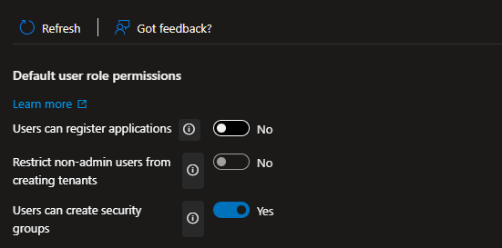

5. **Block User Consent to Applications**
    - In the Entra ID blade, select **Manage** > **Enterprise applications**.
    - Click **Security** > **Consent and permissions**.
    - Under **User consent settings**, set **Users can consent to apps accessing company data on their behalf** to **Do not allow**.
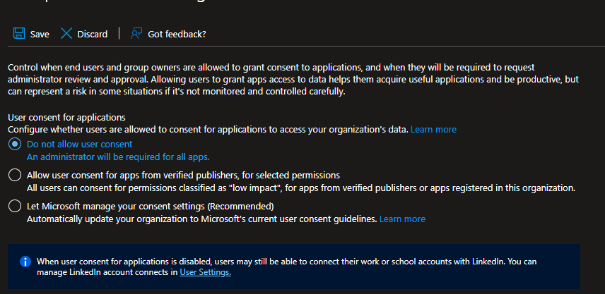

6. **Save Changes**
    - Click **Save** after each change.

7. **Verify**
    - Try registering an app or consenting to an app as a user to confirm restrictions are enforced.

### Platform Requirements

CyberPreacher LTD identifies the following platform protection requirements:

- Microsoft Antimalware must be installed on the Virtual machines in **AZ500RG1**.

- Members of Group2 must be assigned the Azure Kubernetes Service Cluster Admin Role.

- Entra ID users must be able to authenticate to AKS1 by using their Entra ID credentials.

- Following the implementation of the planned changes, the IT team must be able to connect to VM0 by using JIT VM access.

- A new custom RBAC role name Role1 must be used to delegate the administration of the managed disks in **AZ500RG1**. Role1 must be available only for RG1

### Meeting Platform Protection Requirements

#### 1. Install Microsoft Antimalware on Virtual Machines in AZ500RG1

1. **Open Azure Portal**
    - Go to [https://portal.azure.com](https://portal.azure.com) and sign in.
2. **Navigate to Resource Group**
    - Select **Resource groups** > **AZ500RG1**.
3. **Select Each Virtual Machine**
    - Click on each VM (e.g., VM0, VM1, etc.).
4. **Install Antimalware Extension**
    - In the VM blade, select **Settings** > **Extensions + applications** > **+ Add**.
    - Search for **Microsoft Antimalware**.
    - Click **Create** and configure settings as needed.
    - Click **Review + create** > **Create**.
5. **Verify Installation**
    - Confirm the extension appears in the **Extensions** list for each VM.
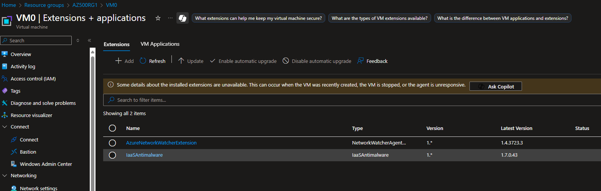

#### 2. Assign Azure Kubernetes Service Cluster Admin Role to Group2

1. **Open Azure Portal**
    - Sign in and go to **Resource groups** > **AZ500RG1**.
2. **Navigate to AKS1**
    - Click on **AKS1**.
3. **Access Control (IAM)**
    - Select **Access control (IAM)**.
4. **Add Role Assignment**
    - Click **+ Add** > **Add role assignment**.
    - Select **Azure Kubernetes Service Cluster Admin Role**.
    - Assign to **Group2**.
    - Click **Review + assign**.
5. **Verify Assignment**
    - Ensure **Group2** is listed under role assignments for AKS1.
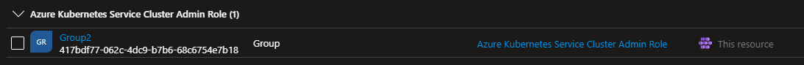

#### 3. Enable Entra ID Authentication for AKS1

1. **Open AKS1 in Azure Portal**
    - Go to **Resource groups** > **AZ500RG1** > **AKS1**.
2. **Check Authentication Settings**
    - Under **Settings**, select **Authentication**.
    - Ensure **Entra ID** integration is enabled.
    - If not, click **Update** and enable **Entra ID with Azure RBAC**.
    - Assign appropriate Entra ID groups for admin/user access.
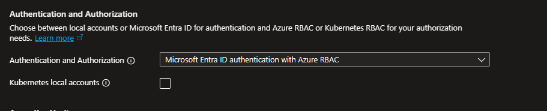
3. **Save and Apply**
    - Click **Save** to apply changes.
4. **Test Authentication**
    - Use `az aks get-credentials` and `kubectl` as an Entra ID user to verify access.

#### 4. Enable JIT VM Access for IT Team to VM0 (Your environment might not have upgraded access to this)

1. **Open Azure Security Center**
    - In the portal, search for **Microsoft Defender for Cloud** (formerly Security Center).
2. **Navigate to JIT VM Access**
    - Under **Workload Protection**, select **Just-in-time VM access**.
3. **Select VM0**
    - Find **VM0** in the list and select it.
4. **Enable JIT**
    - Click **Enable JIT on VMs**.
    - Configure allowed ports (e.g., RDP/SSH), source IPs, and maximum access time.
    - Click **Save**.
5. **Verify**
    - Request JIT access and confirm IT team members can connect as expected.

#### 5. Create Custom RBAC Role (Role1) for Managed Disks in AZ500RG1

1. **Define Role1 JSON**
    - Create a JSON file with permissions for managing disks (e.g., `role1.json`):
      ```json
      {
        "Name": "Role1",
        "IsCustom": true,
        "Description": "Custom role to manage managed disks in AZ500RG1",
        "Actions": [
          "Microsoft.Compute/disks/*"
        ],
        "NotActions": [],
        "AssignableScopes": [
          "/subscriptions/<subscription-id>/resourceGroups/AZ500RG1"
        ]
      }
      ```
2. **Upload Role in Azure Portal or CLI**
    - Upload the file into Azure CLI
    - Use Azure CLI:
      ```sh
      az role definition create --role-definition role1.json
      ```
3. **Assign Role1**
    - Go to **AZ500RG1** > **Access control (IAM)** > **+ Add** > **Add role assignment**.
    - Select **Role1** and assign to the appropriate users/groups.
4. **Verify**
    - Confirm the custom role is only available in **AZ500RG1** and users can manage disks as intended.

## Troubleshooting Made

To ensure users can access their VMs, you must properly configure both the Azure Firewall and the route table:

### 1. Configure Azure Firewall DNAT Rules

  - Go to **Firewall1** in the Azure Portal.
  - Under **Settings**, select **Rules** > **NAT rules**.
  - Click **+ Add NAT rule**.
  - Specify a name for the rule (e.g., `RDP-to-VM0` or `SSH-to-VM0`).
  - Set the **Source addresses** to the trusted public IPs or ranges.
  - Set the **Destination addresses** to the public IP of **Firewall1**.
  - Set the **Destination ports** to the required port (e.g., 3389 for RDP, 22 for SSH).
  - Set the **Translated address** to the private IP address of the target VM.
  - Set the **Translated port** to match the required port (e.g., 3389 or 22).
  - Save and apply the NAT rule.
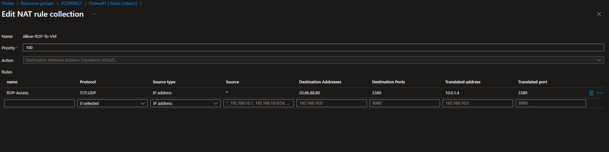

### 2. Update the Route Table

  - Go to **RT1** in the Azure Portal.
  - Under **Settings**, select **Routes**.
  - Ensure there is a route with:
      - **Address prefix**: `0.0.0.0/0`
      - **Next hop type**: Virtual appliance
      - **Next hop address**: Private IP of Firewall1
  - Confirm **RT1** is associated with **Subnet0**.
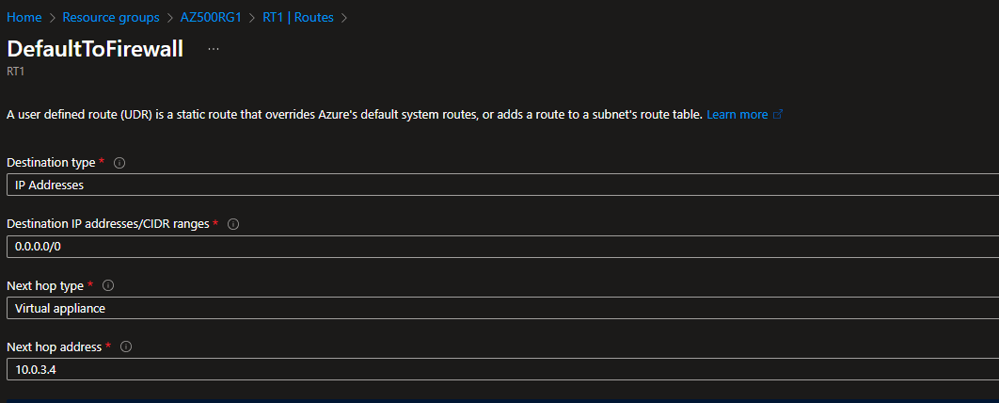

### 3. Verify Connectivity

  - After updating the firewall and route table, test VM access from an allowed source.
  - If access fails, review firewall rules, NSG settings, and JIT access configuration.

**Tip:** Always restrict access to only trusted IPs and required ports to maintain security.

