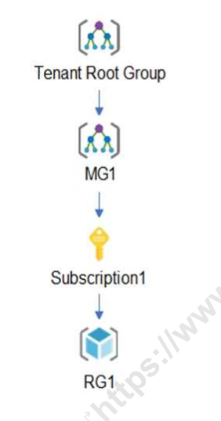
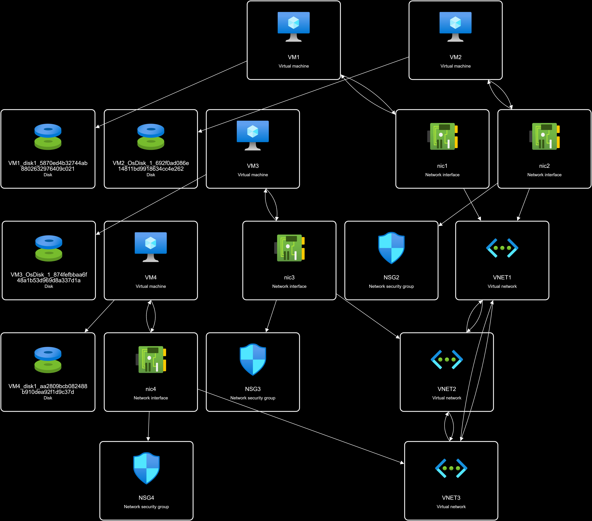

---
CyberPreacher Lab:
    title: '09 - Organization Case Study 2'
    difficulty: 'Hard'
---

# Project 09: Organization Case Study 2
## CyberPreacher Edition  

## Summary
This project details the design and implementation of a secure, multi-region Azure infrastructure for CyberPreacher LTD, a consulting company with offices in Montreal, Seattle, and New York. It covers the deployment of resource groups, virtual networks, subnets, network security groups, and virtual machines across West US and Central US regions. The solution includes VNET peering for seamless connectivity, application security groups, disk encryption, just-in-time VM access, and secure management of application secrets using Azure Key Vault with private endpoints. It also addresses compliance requirements such as conditional access policies, customer-managed storage encryption, and integration with Azure Sentinel for security monitoring and investigation. The project ensures that all technical and organizational requirements are met for a robust, compliant, and scalable cloud environment.

## Compamy Overview  

CyberPreacher LTD is a consulting company that has a main office in Montreal and branch offices in Seattle and New York. Fabrikam has IT, human resources (HR), and finance departments.

### Existing Environment

#### Network Environment

CyberPreacher hasa Microsoft 365 subscription and an Azure subscription named Subscription1.
The network contains an on-premises Active Directory domain named cyberpreacher.com. The domain contains two Organizational units (OUs) named OU1 and OU2. Entra ID Connect cloud sync syncs only OU1.

Thr resources hierarchy is shown in the following exhibit.



The Entra ID tenant contains the users shown in the following table.

|Name|Type|Directory-synced|Role|Delegated to|
|---|---|---|---|---|
|User1|User|Yes|User|None|
|Admin1|User|No|User Access Adminstrator|Tenant Root Group|
|Admin2|User|No|Security Administrator|MG1|
|Admin3|User|No|Contributor|Subscription1|
|Admin4|User|No|Owner|RG1|
|Group1|Group|No|Not applicable|None|

Entra ID contains the resources shown in the following table. 

|Name|Type|Settings|
|---|---|---|
|CAPolicy1|Conditional access policy|Users in the finance department must use multi-factor authentication (MFA) when accessing Microsoft SharePoint Online|
|Sentinel1|Azure Sentinel workspace|Not applicable|
|SecPol1|Azure Policy definition|Security configuration for virtual machines|

Subscription1 Resources

Subscription1 contains the virtual networks shown in the following table.

|Name|Subnet|Location|Peer|
|---|---|---|---|
|VNET1|Subnet1, Subnet2|West US|VNET2, VNET3|
|VNET2|Subnet1|Central US|VNET1, VNET3|
|VNET3|Subnet1|West US|VNET1, VNET2|

Subscription1 contains the network security groups (NSGs) shown in the following table.

|Name|Location|
|---|---|
|NSG2|West US|
|NSG3|Central US|
|NSG4|West US|

Subscription1 contains the virtual machines shown in the following table.

|Name|Operating system|Location|Connected for|Association NSG|
|---|---|---|---|---|
|VM1|Windows Server 2019|West US|VNET1/Subnet1|None|
|VM2|CentOS-based 8.2|West US|VNET1/Subnet2|NSG2|
|VM3|Windows Server 2016|Central US|VNET2/Subnet1|NSG3|
|VM4|Ubuntu Server 18.04 LTS|West US|VNET3/Subnet1|NSG4|

Subscription1 contains a storage account named storage1 in the West US Azure region.

### Planned Changes and Requirements

#### Planned Changes

Fabrikam plans to implement the following table.

|Name|Location|
|---|---|
|ASG1|West US|
|ASG2|Central US|

- Associate the network interface of VM1 to ASG1.

- Deploy SecPol1 by using Azure Security Center.

- Deploy a third-party app amed App1. A version of App1 exists for all available operating systems.

- Create a resource group named RG2.

- Sync OU2 to Entra ID.

- Add User1 to Group1.

#### Technical Requirements

CyberPreacher LTD identifies the following technical requirements:

- The finance department users must reauthenticate after three hours when they access SharePoint Online.

- Storage1 must be encrypted by using customer-managed keys and automatic key rotation.

- From Sentinel1, you must ensure that the following notebooks cam be launched.

    1. Entity Explorer - Account

    2. Entity Explorer - Windows Host

    3. Guided Investigation Process Alerts

- VM1, VM2 and VM3 must be encrypted by using Azure Disk Encyption.

- Just in time (JIT) VM access for VM1, VM2, and VM3 must be enabled.

- App1 must use a secure connection string stored in KeyVault.

- KeyVault1 traffic must NOT travel over the internet.

## Solution  

### 1. Deploy Base Infrastructure

#### a. Create Resource Groups, VNETs, Subnets, and NSGs

Use an ARM template or Bicep to deploy the following resources:

- Resource Group: `RG1`
- Virtual Networks: `VNET1` (West US), `VNET2` (Central US), `VNET3` (West US)
- Subnets:
    - VNET1: `Subnet1`, `Subnet2`
    - VNET2: `Subnet1`
    - VNET3: `Subnet1`
- NSGs: `NSG2` (West US), `NSG3` (Central US), `NSG4` (West US)

Example ARM template (JSON) to deploy all three VNETs, their subnets, and NSGs:

```json
{
    "$schema": "https://schema.management.azure.com/schemas/2019-04-01/deploymentTemplate.json#",
    "contentVersion": "1.0.0.0",
    "resources": [
        {
            "type": "Microsoft.Network/virtualNetworks",
            "apiVersion": "2022-07-01",
            "name": "VNET1",
            "location": "West US",
            "properties": {
                "addressSpace": { "addressPrefixes": ["10.1.0.0/16"] },
                "subnets": [
                    { "name": "Subnet1", "properties": { "addressPrefix": "10.1.1.0/24" } },
                    { "name": "Subnet2", "properties": { "addressPrefix": "10.1.2.0/24" } }
                ]
            }
        },
        {
            "type": "Microsoft.Network/virtualNetworks",
            "apiVersion": "2022-07-01",
            "name": "VNET2",
            "location": "Central US",
            "properties": {
                "addressSpace": { "addressPrefixes": ["10.2.0.0/16"] },
                "subnets": [
                    { "name": "Subnet1", "properties": { "addressPrefix": "10.2.1.0/24" } }
                ]
            }
        },
        {
            "type": "Microsoft.Network/virtualNetworks",
            "apiVersion": "2022-07-01",
            "name": "VNET3",
            "location": "West US",
            "properties": {
                "addressSpace": { "addressPrefixes": ["10.3.0.0/16"] },
                "subnets": [
                    { "name": "Subnet1", "properties": { "addressPrefix": "10.3.1.0/24" } }
                ]
            }
        },
        {
            "type": "Microsoft.Network/networkSecurityGroups",
            "apiVersion": "2022-07-01",
            "name": "NSG2",
            "location": "West US",
            "properties": {}
        },
        {
            "type": "Microsoft.Network/networkSecurityGroups",
            "apiVersion": "2022-07-01",
            "name": "NSG3",
            "location": "Central US",
            "properties": {}
        },
        {
            "type": "Microsoft.Network/networkSecurityGroups",
            "apiVersion": "2022-07-01",
            "name": "NSG4",
            "location": "West US",
            "properties": {}
        }
    ]
}
```

> This template creates VNET1 (with Subnet1 and Subnet2), VNET2 (with Subnet1), VNET3 (with Subnet1), and NSGs NSG2, NSG3, NSG4.

#### b. Peer VNETs

#### b. Peer VNETs

To set up VNET peering between VNET1, VNET2, and VNET3, follow these steps:

1. **Identify VNETs and Regions**
    - VNET1: West US
    - VNET2: Central US
    - VNET3: West US

2. **Create VNET Peerings**
    - Peer VNET1 ↔ VNET2
    - Peer VNET1 ↔ VNET3
    - Peer VNET2 ↔ VNET3

3. **Azure Portal Steps**
    - Go to each VNET in the Azure Portal.
    - Under "Settings", select "Peerings".
    - Click "Add" to create a new peering.
    - Specify the remote VNET and configure options (allow traffic, gateway transit if needed).
    - Repeat for each required peering.

4. **Azure CLI Example**
    ```sh
    # Peer VNET1 to VNET2
    az network vnet peering create \
      --name VNET1-to-VNET2 \
      --resource-group RG1 \
      --vnet-name VNET1 \
      --remote-vnet VNET2 \
      --allow-vnet-access

    # Peer VNET2 to VNET1
    az network vnet peering create \
      --name VNET2-to-VNET1 \
      --resource-group RG1 \
      --vnet-name VNET2 \
      --remote-vnet VNET1 \
      --allow-vnet-access
    ```

    ## VNET1 ↔ VNET3

    ```sh
    # Peer VNET1 to VNET3
    az network vnet peering create \
        --name VNET1-to-VNET3 \
        --resource-group RG1 \
        --vnet-name VNET1 \
        --remote-vnet VNET3 \
        --allow-vnet-access

    # Peer VNET3 to VNET1
    az network vnet peering create \
        --name VNET3-to-VNET1 \
        --resource-group RG1 \
        --vnet-name VNET3 \
        --remote-vnet VNET1 \
        --allow-vnet-access
    ```

    ## VNET2 ↔ VNET3

    ```sh
    # Peer VNET2 to VNET3
    az network vnet peering create \
        --name VNET2-to-VNET3 \
        --resource-group RG1 \
        --vnet-name VNET2 \
        --remote-vnet VNET3 \
        --allow-vnet-access

    # Peer VNET3 to VNET2
    az network vnet peering create \
        --name VNET3-to-VNET2 \
        --resource-group RG1 \
        --vnet-name VNET3 \
        --remote-vnet VNET2 \
        --allow-vnet-access
    ```

    **Notes:**
    - Always create peering in both directions for full connectivity.
    - Ensure "Allow virtual network access" is enabled.
    - After configuring, verify peering status and test connectivity between VMs in different VNETs.

    This ensures seamless communication between all VNETs as required for the project.
    ```

5. **Verify Connectivity**
    - Ensure peering status is "Connected" for all links.
    - Test VM connectivity across VNETs.

> VNET peering enables seamless communication between resources in different VNETs with low latency and high bandwidth.


#### c. Deploy Virtual Machines

Deploy VMs using templates:

- VM1: Windows Server 2019 (VNET1/Subnet1)
- VM2: CentOS 8.2 (VNET1/Subnet2, NSG2)
- VM3: Windows Server 2016 (VNET2/Subnet1, NSG3)
- VM4: Ubuntu 18.04 LTS (VNET3/Subnet1, NSG4)

Example VM deployment (Bicep):

```json
{
    "$schema": "https://schema.management.azure.com/schemas/2019-04-01/deploymentTemplate.json#",
    "contentVersion": "1.0.0.0",
    "parameters": {
        "adminUsername": {
            "type": "string"
        },
        "adminPassword": {
            "type": "secureString"
        }
    },
    "resources": [
        {
            "type": "Microsoft.Network/networkInterfaces",
            "apiVersion": "2022-09-01",
            "name": "nic1",
            "location": "West US",
            "properties": {
                "ipConfigurations": [
                    {
                        "name": "ipconfig1",
                        "properties": {
                            "subnet": {
                                "id": "[resourceId('Microsoft.Network/virtualNetworks/subnets', 'VNET1', 'Subnet1')]"
                            },
                            "privateIPAllocationMethod": "Dynamic"
                        }
                    }
                ]
            }
        },
        {
            "type": "Microsoft.Compute/virtualMachines",
            "apiVersion": "2022-08-01",
            "name": "VM1",
            "location": "West US",
            "properties": {
                "hardwareProfile": { "vmSize": "Standard_DS1_v2" },
                "storageProfile": {
                    "imageReference": {
                        "publisher": "MicrosoftWindowsServer",
                        "offer": "WindowsServer",
                        "sku": "2019-Datacenter",
                        "version": "latest"
                    },
                    "osDisk": { "createOption": "FromImage" }
                },
                "osProfile": {
                    "computerName": "VM1",
                    "adminUsername": "[parameters('adminUsername')]",
                    "adminPassword": "[parameters('adminPassword')]"
                },
                "networkProfile": {
                    "networkInterfaces": [
                        { "id": "[resourceId('Microsoft.Network/networkInterfaces', 'nic1')]" }
                    ]
                }
            }
        },
        {
            "type": "Microsoft.Network/networkInterfaces",
            "apiVersion": "2022-09-01",
            "name": "nic2",
            "location": "West US",
            "properties": {
                "ipConfigurations": [
                    {
                        "name": "ipconfig1",
                        "properties": {
                            "subnet": {
                                "id": "[resourceId('Microsoft.Network/virtualNetworks/subnets', 'VNET1', 'Subnet2')]"
                            },
                            "privateIPAllocationMethod": "Dynamic"
                        }
                    }
                ],
                "networkSecurityGroup": {
                    "id": "[resourceId('Microsoft.Network/networkSecurityGroups', 'NSG2')]"
                }
            }
        },
        {
            "type": "Microsoft.Compute/virtualMachines",
            "apiVersion": "2022-08-01",
            "name": "VM2",
            "location": "West US",
            "properties": {
                "hardwareProfile": { "vmSize": "Standard_DS1_v2" },
                "storageProfile": {
                    "imageReference": {
                        "publisher": "MicrosoftWindowsServer",
                        "offer": "WindowsServer",
                        "sku": "2019-Datacenter",
                        "version": "latest"
                    },
                    "osDisk": { "createOption": "FromImage" }
                },
                "osProfile": {
                    "computerName": "VM2",
                    "adminUsername": "[parameters('adminUsername')]",
                    "adminPassword": "[parameters('adminPassword')]"
                },
                "networkProfile": {
                    "networkInterfaces": [
                        { "id": "[resourceId('Microsoft.Network/networkInterfaces', 'nic2')]" }
                    ]
                }
            }
        },
        {
            "type": "Microsoft.Network/networkInterfaces",
            "apiVersion": "2022-09-01",
            "name": "nic3",
            "location": "Central US",
            "properties": {
                "ipConfigurations": [
                    {
                        "name": "ipconfig1",
                        "properties": {
                            "subnet": {
                                "id": "[resourceId('Microsoft.Network/virtualNetworks/subnets', 'VNET2', 'Subnet1')]"
                            },
                            "privateIPAllocationMethod": "Dynamic"
                        }
                    }
                ],
                "networkSecurityGroup": {
                    "id": "[resourceId('Microsoft.Network/networkSecurityGroups', 'NSG3')]"
                }
            }
        },
        {
            "type": "Microsoft.Compute/virtualMachines",
            "apiVersion": "2022-08-01",
            "name": "VM3",
            "location": "Central US",
            "properties": {
                "hardwareProfile": { "vmSize": "Standard_DS1_v2" },
                "storageProfile": {
                    "imageReference": {
                        "publisher": "MicrosoftWindowsServer",
                        "offer": "WindowsServer",
                        "sku": "2019-Datacenter",
                        "version": "latest"
                    },
                    "osDisk": { "createOption": "FromImage" }
                },
                "osProfile": {
                    "computerName": "VM3",
                    "adminUsername": "[parameters('adminUsername')]",
                    "adminPassword": "[parameters('adminPassword')]"
                },
                "networkProfile": {
                    "networkInterfaces": [
                        { "id": "[resourceId('Microsoft.Network/networkInterfaces', 'nic3')]" }
                    ]
                }
            }
        },
        {
            "type": "Microsoft.Network/networkInterfaces",
            "apiVersion": "2022-09-01",
            "name": "nic4",
            "location": "West US",
            "properties": {
                "ipConfigurations": [
                    {
                        "name": "ipconfig1",
                        "properties": {
                            "subnet": {
                                "id": "[resourceId('Microsoft.Network/virtualNetworks/subnets', 'VNET3', 'Subnet1')]"
                            },
                            "privateIPAllocationMethod": "Dynamic"
                        }
                    }
                ],
                "networkSecurityGroup": {
                    "id": "[resourceId('Microsoft.Network/networkSecurityGroups', 'NSG4')]"
                }
            }
        },
        {
            "type": "Microsoft.Compute/virtualMachines",
            "apiVersion": "2022-08-01",
            "name": "VM4",
            "location": "West US",
            "properties": {
                "hardwareProfile": { "vmSize": "Standard_DS1_v2" },
                "storageProfile": {
                    "imageReference": {
                        "publisher": "MicrosoftWindowsServer",
                        "offer": "WindowsServer",
                        "sku": "2019-Datacenter",
                        "version": "latest"
                    },
                    "osDisk": { "createOption": "FromImage" }
                },
                "osProfile": {
                    "computerName": "VM4",
                    "adminUsername": "[parameters('adminUsername')]",
                    "adminPassword": "[parameters('adminPassword')]"
                },
                "networkProfile": {
                    "networkInterfaces": [
                        { "id": "[resourceId('Microsoft.Network/networkInterfaces', 'nic4')]" }
                    ]
                }
            }
        }
    ]
}
```

### 2. Implement Planned Changes

#### a. Create Application Security Groups (ASGs)
1. In the Azure Portal, navigate to "Application Security Groups".
2. Create `ASG1` in the West US region.
3. Create `ASG2` in the Central US region.

#### b. Associate VM1's NIC to ASG1
1. Go to VM1's network interface (NIC) in the portal.
2. Under "Application security groups", select `ASG1` and save.

#### c. Deploy `SecPol1` via Azure Security Center (Not Included in Subscription)
1. In Azure Security Center, go to "Policy & Compliance".
2. Assign the `SecPol1` policy definition to the relevant scope (e.g., subscription or resource group).
3. Review and remediate any non-compliant resources.

#### d. Deploy Third-Party App `App1` on All VMs
1. Obtain installation packages for all OS versions of `App1`.
2. Connect to each VM (using RDP/SSH).
3. Install `App1` on VM1 (Windows), VM2 (CentOS), VM3 (Windows), and VM4 (Ubuntu).
4. Verify successful installation.

#### e. Create Resource Group `RG2`
1. In the Azure Portal, select "Resource groups".
2. Click "Create".
3. Enter `RG2` as the name and select the desired region.
4. Click "Review + Create" and then "Create".

#### f. Sync OU2 to Entra ID
1. Open Entra ID Connect on the on-premises server.
2. Update the sync configuration to include OU2.
3. Run a synchronization to sync OU2 users/groups to Entra ID.

#### g. Add User1 to Group1
1. In the Entra ID portal, go to "Groups" and select `Group1`.
2. Click "Members" > "Add members".
3. Search for `User1` and add to the group.
4. Alternatively, use PowerShell:
    ```powershell
    Add-AzureADGroupMember -ObjectId <Group1ObjectId> -RefObjectId <User1ObjectId>
    ```

### 3. Meet Technical Requirements

#### a. Conditional Access

- Update `CAPolicy1` to require reauthentication after 3 hours for finance users accessing SharePoint Online.

#### b. Storage Encryption

- Enable customer-managed keys and automatic key rotation for `storage1`:
    - Create Key Vault.
    - Configure Storage Account encryption with CMK.
    - Enable automatic key rotation.

#### c. Sentinel Notebooks

- In Sentinel1, ensure the following notebooks are enabled and accessible:
    1. **Entity Explorer - Account**
    2. **Entity Explorer - Windows Host**
    3. **Guided Investigation Process Alerts**

**Steps:**
1. In the Azure Portal, navigate to the Sentinel1 workspace.
2. Go to "Notebooks" under the "Threat Management" section.
3. Verify that the required notebooks are listed. If not, click "Add notebook" and select from the Azure Sentinel gallery.
4. For each notebook:
    - Open the notebook to confirm it loads successfully.
    - Ensure permissions are set so security analysts can access and run the notebooks.
    - If required, configure the workspace with an Azure ML workspace for advanced notebook features.
5. Test launching each notebook to confirm they are operational and can access relevant data.

> This ensures that analysts can use the specified notebooks for investigation and threat hunting as required by the project.

#### d. VM Disk Encryption

#### d. VM Disk Encryption

- **Enable Azure Disk Encryption for VM1, VM2, and VM3:**

    1. **Prerequisites:**
        - Ensure you have a Key Vault with appropriate permissions for disk encryption.
        - Assign the "Disk Encryption" and "Key Vault Crypto Service Encryption User" roles to the VM's managed identity or service principal.

    2. **Using Azure Portal:**
        - Go to each VM (VM1, VM2, VM3) in the Azure Portal.
        - Under "Settings", select "Disks" > "Encryption".
        - Choose "Azure Disk Encryption".
        - Select the Key Vault and encryption key.
        - Click "Save" to start the encryption process.

    3. **Using Azure CLI:**
        ```sh
        # Encrypt VM1 (Windows)
        az vm encryption enable \
          --name VM1 \
          --resource-group RG1 \
          --disk-encryption-keyvault <KeyVaultName> \
          --volume-type All

        # Encrypt VM2 (If Linux)
        az vm encryption enable \
          --name VM2 \
          --resource-group RG1 \
          --disk-encryption-keyvault <KeyVaultName> \
          --volume-type All

        # Encrypt VM3 (Windows)
        az vm encryption enable \
          --name VM3 \
          --resource-group RG1 \
          --disk-encryption-keyvault <KeyVaultName> \
          --volume-type All
        ```

    4. **Verification:**
        - After encryption, check the VM's disk status in the portal or run:
        ```sh
        az vm show --name <VMName> --resource-group RG1 --query "storageProfile.osDisk.encryptionSettings"
        ```
        - Ensure the disks show as "Encrypted".

    > Azure Disk Encryption helps protect and safeguard your data to meet organizational security and compliance commitments.

#### e. JIT VM Access (Not applicable)

- Enable Just-In-Time access for VM1, VM2, and VM3 in Azure Security Center.

#### f. Secure App Connection String

To securely manage App1's connection string, follow these steps:

1. **Store the Connection String in KeyVault1**
    - In the Azure Portal, navigate to KeyVault1.
    - Under "Secrets", click "Generate/Import".
    - Enter a name (e.g., `App1-ConnectionString`) and paste the connection string value.
    - Click "Create" to store the secret.

2. **Configure App1 to Retrieve the Connection String Securely**
    - Assign a managed identity (system-assigned or user-assigned) to each VM hosting App1.
        - In the VM's "Identity" blade, enable "System assigned managed identity".
    - Grant the managed identity access to KeyVault1:
        - In KeyVault1, go to "Access policies".
        - Add a new access policy for the managed identity.
        - Select "Get" permission for secrets.
        - Save the access policy.

3. **App1 Securely Accesses the Connection String**
    - Update App1's configuration to use Azure SDK or REST API to retrieve the connection string from KeyVault1 at runtime.
    - Example (for .NET apps):
        ```csharp
        var kvUri = "https://<KeyVault1-Name>.vault.azure.net";
        var client = new SecretClient(new Uri(kvUri), new DefaultAzureCredential());
        KeyVaultSecret secret = await client.GetSecretAsync("App1-ConnectionString");
        string connectionString = secret.Value;
        ```
    - For Linux VMs, use the appropriate SDK (e.g., Python, Node.js) and managed identity authentication.

> This approach ensures App1 never stores sensitive connection strings in code or configuration files, and only authorized VMs can access the secret via managed identity.


#### g. KeyVault Network Security

To ensure KeyVault1 traffic does NOT travel over the internet:

1. **Configure Private Endpoint for KeyVault1**
    - In the Azure Portal, go to KeyVault1.
    - Under "Networking", select "Private endpoint connections".
    - Click "Add" and create a private endpoint in the appropriate subnet (e.g., within VNET1).
    - Ensure DNS is configured so resources resolve KeyVault1 to the private endpoint.

2. **Restrict Public Network Access**
    - In KeyVault1's "Networking" blade, set "Public access" to "Disabled".
    - This ensures only traffic from the private endpoint (inside your VNET) can access KeyVault1.

3. **Verification**
    - Attempt to access KeyVault1 from outside the VNET; access should be denied.
    - Confirm VMs in the VNET can access KeyVault1 via the private endpoint.

> This configuration ensures all KeyVault1 traffic remains on the Azure backbone and never traverses the public internet, meeting the project's security requirements.




> Note: Delete all resources once project is completed to prevent unnecessary charges.

> Side Task: Share screenshots on LinkedIn showing attack visualization and include hashtags **#cloudprojectwithcyberpreacher** and **#CPwCP**. Share your experience and learnings from this SOC lab.