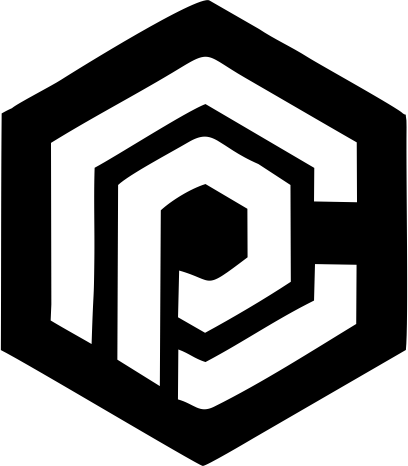

<!-- REPLACE THE URL BELOW WITH YOUR LOGO IMAGE URL -->

# CyberPreacher Cloud Security Arena

**Secure. Defend. Deploy.**

---

### Introduction
Welcome to the **Cloud Project Arena**. This repository is a collection of cloud security projects designed to take you from beginner to expert.

**Goal:** Build the biggest cloud security project base of 2025.

[Access HTML View](https://thecyberpreacher.github.io/cloud-project/)

---

## Cloud Security Projects

### [AWS Security Projects](./AWS/README.md)
*Defending Amazon Cloud Infrastructure*

| ID | Project | Status |
| :--- | :--- | :--- |
| 01 | [AWS Project 1](./AWS/AWS-Project_1.md) | Ready |
| 02 | [AWS Project 2](./AWS/AWS-Project_2.md) | Ready |
| 03 | [AWS Project 3](./AWS/AWS-Project_3.md) | Ready |
| 04 | [AWS Project 4](./AWS/AWS-Project_4.md) | Ready |
| 05 | [AWS Project 5](./AWS/AWS-Project_5.md) | Ready |
| 06 | [AWS Project 6](./AWS/AWS-Project_6.md) | Ready |
| 07 | [AWS Project 7](./AWS/AWS-Project_7.md) | Ready |

### [Azure Security Projects](./Azure/README.md)
*Securing the Microsoft Azure Perimeter*

| ID | Project | Status |
| :--- | :--- | :--- |
| 01 | [Azure Project 1](./Azure/Azure-Project_1.md) | Ready |
| 02 | [Azure Project 2](./Azure/Azure-Project_2.md) | Ready |
| 03 | [Azure Project 3](./Azure/Azure-Project_3.md) | Ready |
| 04 | [Azure Project 4](./Azure/Azure-Project_4.md) | Ready |
| 05 | [Azure Project 5](./Azure/Azure-Project_5.md) | Ready |
| 06 | [Azure Project 6](./Azure/Azure-Project_6.md) | Ready |
| 07 | [Azure Project 7](./Azure/Azure-Project_7.md) | Ready |
| 08 | [Azure Project 8](./Azure/Azure-Project_8.md) | Ready |
| 09 | [Azure Project 9](./Azure/Azure-Project_9.md) | Ready |
| 10 | [Azure Project 10](./Azure/Azure-Project_10.md) | Ready |
| 11 | [Azure Project 11](./Azure/Azure-Project_11.md) | Ready |
| 12 | [Azure Project 12](./Azure/Azure-Project_12.md) | Ready |
| -- | [WebApp Deploy](./Azure/WebApp_Deploy.md) | Deploy |

### [GCP Security Projects](./GCP/README.md)
*Fortifying Google Cloud Platform Assets*

| ID | Project | Status |
| :--- | :--- | :--- |
| 01 | [GCP Project 1](./GCP/GCP-Project_1.md) | Ready |
| 02 | [GCP Project 2](./GCP/GCP-Project_2.md) | Ready |
| 03 | [GCP Project 3](./GCP/GCP-Project_3.md) | Ready |
| 04 | [GCP Project 4](./GCP/GCP-Project_4.md) | Ready |
| 05 | [GCP Project 5](./GCP/GCP-Project_5.md) | Ready |
| 06 | [GCP Project 6](./GCP/GCP-Project_6.md) | Ready |
| 07 | [GCP Project 7](./GCP/GCP-Project_7.md) | Ready |

---

## Lab Resources
Access critical data files and templates for your projects in the [Lab_Files](./Lab_Files/) directory.
- `bulkusertemplate.csv`
- `PR10BulkUser.csv`
- `SC300BulkUser.csv`

## Prerequisites
Before starting, ensure you have the following:
- **Cloud Access:** Active accounts on AWS, Azure, or GCP.
- **Knowledge Base:** Basic understanding of cloud platforms and security concepts.
- **Terminal:** CLI tools installed (AWS CLI, Azure CLI, gcloud).

## Contributing
We welcome contributions. If you have a new security protocol or project idea:
1. Fork the repository.
2. Create your feature branch.
3. Submit a Pull Request.

## License
This project is licensed under the **MIT License**. See the [LICENSE](LICENSE) file for details.
